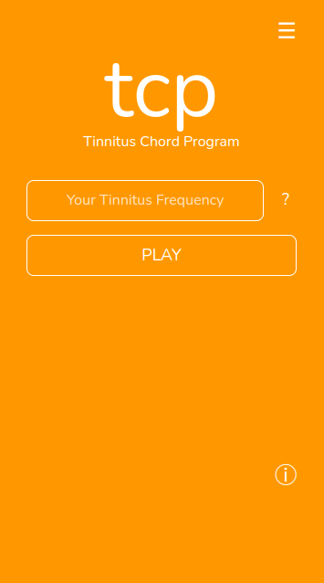

# Tinnitus Chord Program
The Tinnitus Chord Program (tcp) forms a chord with a given tinnitus frequency.

## Abstract
*tcp* is a web application for masking chronic tonal tinnitus in the frequency range between 27 and 4200 Hz. The aim is to reduce the noisy tinnitus sound by considering the tinnitus as a musical tone. Based on the frequency of the tinnitus, one can create a tone scale and a chord, so that the tinnitus is part of a musical sound. Maybe this could reduce the noisy sound.

## Description
There have been many strategies of masking a tinnitus with white noise and nature sounds. The aim of those approaches is that the frequency of the tinnitus is also presented in te white noise and may 'dissappear' and may be not present in ones head when hearing all other frquencies too.
Another possibility might be to consider the tinnitus as a tone, which one can use as a material to create music (e.g. chords). This project shall give some impressions about such possibilities.

## Technical Aspects
The application uses the Web Audio API to create sinus tones.
At the beginning of a program, the frequency must be evaluated to determine whether a chord can be formed above, between or below the tinnitus frequency.

## Limitations
* The range of the tinnitus should be in the range of a piano (between 27 and 4200 Hz). It seems that a chord formed above a certain frequency is no longer perceived as a chord formation, but simply as a shrill sound. The same seems true if one selects a high tinnitus and plays a chord below (also in high range). That's why the range in this project is set to the range of the piano. It must be carefully evaluated the position (range) of the chord.
* The *tcp* builds a chord with the tinnitus. Focussing on the tinnitus may lead to a more present tinnitus (-> that's a sign of contraindication).

## Sate
* in Development (not ready for productive mode)
